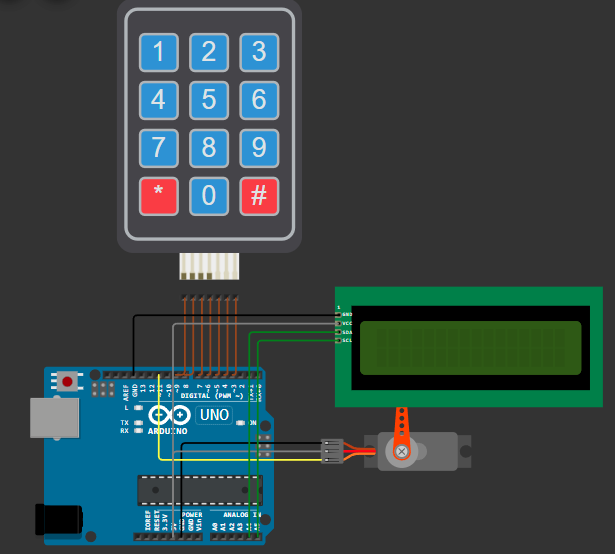

# 🚪 Sistem Keamanan dengan Kode Akses (Arduino + Wokwi)

Proyek ini mensimulasikan sistem keamanan digital menggunakan keypad, LCD I2C, dan servo motor sebagai pengunci pintu virtual di platform Wokwi.

## 🛠 Komponen
- Arduino Uno
- Keypad 4x3
- LCD 16x2 dengan modul I2C
- Servo Motor

## 🖼️ Gambar Rangkaian



## 🔌 Wiring Diagram
```plaintext
Keypad:
- Rows → Pin 6,7,8,9 Arduino
- Columns → Pin 3,4,5 Arduino

LCD I2C:
- SDA → A4
- SCL → A5

Servo:
- Signal → Pin 11
```

## 📝 Cara Penggunaan

1. Masukkan kode via **keypad** (kode default: `1234`)  
2. Tekan `#` untuk **konfirmasi**  
3. Tekan `*` untuk **menghapus input**  

### Jika kode benar:
- LCD menampilkan **"Access Granted"**
- **Servo** membuka pada sudut **90°**
- Otomatis **terkunci kembali setelah 2.1 detik**

## 🎯 Fitur

✅ Autentikasi kode 4 digit  
✅ Mekanisme penghapusan karakter dengan tombol `*`  
✅ Animasi servo sebagai pengunci pintu  
✅ Tampilan status autentikasi di layar **LCD**
